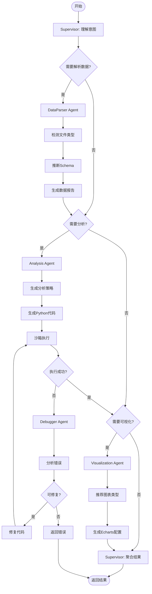

# Multi-Agent Data Analysis Assistant

## 自驱型多Agent自动化数据分析助手

一个生产级的、完全基于自然语言交互的自驱型多Agent数据分析助手。用户无需编写任何代码，只需上传数据并用自然语言提出需求，系统即可自动完成探索性分析并输出可视化结果。

---

## ✨ 核心特性

- 🤖 **自然语言交互** - 无需编写代码，用自然语言描述需求
- 📊 **自动数据分析** - LLM动态生成分析代码
- 📈 **智能可视化** - 自动生成Echarts/Plotly图表
- 🔒 **沙箱安全执行** - Docker隔离环境执行代码
- 🔄 **多Agent协作** - Coordinator调度多个专业Agent
- 🔧 **自动纠错** - Debugger Agent自动修复代码错误

---

## 🏗️ 系统架构

```
┌─────────────────────────────────────────────────────────────┐
│                      前端交互层 (React)                       │
│              双栏响应式界面 (Gemini AI Studio风格)             │
└─────────────────────────┬───────────────────────────────────┘
                          │
┌─────────────────────────▼───────────────────────────────────┐
│                    API网关层 (FastAPI)                       │
│              RESTful API + WebSocket实时通信                  │
└─────────────────────────┬───────────────────────────────────┘
                          │
┌─────────────────────────▼───────────────────────────────────┐
│                  业务编排层 (Coordinator)                     │
│            任务DAG拆解 + 多Agent调度 + 结果聚合                │
└─────────────────────────┬───────────────────────────────────┘
                          │
    ┌─────────┬───────────┼───────────┬─────────┐
    ▼         ▼           ▼           ▼         ▼
┌───────┐ ┌───────┐ ┌───────────┐ ┌───────┐ ┌───────┐
│数据解析│ │探索分析│ │ 可视化    │ │ 纠错  │ │ LLM   │
│ Agent │ │ Agent │ │  Agent    │ │ Agent │ │Engine │
└───────┘ └───────┘ └───────────┘ └───────┘ └───────┘
                          │
┌─────────────────────────▼───────────────────────────────────┐
│                    沙箱执行层 (Docker)                        │
│               隔离代码执行 + 资源限制 + 安全控制                │
└─────────────────────────────────────────────────────────────┘
```

---

## 🚀 快速开始

### 1. 环境要求

- Python 3.10+
- Docker Desktop
- Conda/Miniconda

### 2. 安装依赖

```bash
# 激活 conda 环境
conda activate jiali

# 安装 Python 依赖
pip install -r requirements.txt
```

### 3. 配置环境变量

```bash
# 复制环境变量模板
cp .env.example .env

# 编辑 .env 文件，填入您的 API Key
```

### 4. 启动 Docker 服务

```bash
# 方式一：使用 docker-compose 启动所有服务
docker-compose -f infrastructure/docker/docker-compose.yml up -d

# 方式二：单独启动 PostgreSQL（如只需数据库）
docker run -d --name multi-agent-postgres -e POSTGRES_USER=postgres -e POSTGRES_PASSWORD=postgres -e POSTGRES_DB=multi_agent_db -p 5432:5432 postgres:15-alpine
```

**Docker 服务列表：**

| 服务 | 容器名 | 端口 | 用途 |
|------|--------|------|------|
| PostgreSQL | multi-agent-postgres | 5432 | 主数据库 |
| Redis | multi-agent-redis | 6379 | 缓存/消息队列 |
| RabbitMQ | multi-agent-rabbitmq | 5672, 15672 | 任务队列 |
| MinIO | multi-agent-minio | 9000, 9001 | 对象存储 |
| Prometheus | multi-agent-prometheus | 9090 | 监控指标 |
| Grafana | multi-agent-grafana | 3000 | 监控面板 |

**验证 Docker 服务状态：**
```bash
# 查看所有容器状态
docker ps --format "table {{.Names}}\t{{.Status}}\t{{.Ports}}"

# 验证 PostgreSQL 连接
docker exec multi-agent-postgres pg_isready -U postgres

# 验证 Redis 连接
docker exec multi-agent-redis redis-cli ping
```

### 5. 启动后端服务

```bash
# 进入 backend 目录
cd backend

# 启动 FastAPI 服务
python -m uvicorn app.main:app --host 0.0.0.0 --port 8000

# 或使用热重载模式（开发环境）
python -m uvicorn app.main:app --reload --port 8000
```

### 6. 访问服务

| 服务 | URL | 用户名/密码 |
|------|-----|------------|
| **API文档 (Swagger)** | http://localhost:8000/docs | - |
| **API文档 (ReDoc)** | http://localhost:8000/redoc | - |
| **健康检查** | http://localhost:8000/api/v1/health | - |
| **Prometheus指标** | http://localhost:8000/metrics | - |
| **RabbitMQ管理** | http://localhost:15672 | guest/guest |
| **MinIO控制台** | http://localhost:9001 | minioadmin/minioadmin |
| **Grafana监控** | http://localhost:3000 | admin/admin |
| **Prometheus** | http://localhost:9090 | - |

### 7. 运行测试

```bash
# 进入 backend 目录
cd backend

# 运行所有测试
python -m pytest tests/ -v

# 运行 Agent 相关测试
python -m pytest tests/test_state.py tests/test_graph.py tests/test_supervisor.py -v

# 运行测试并生成覆盖率报告
python -m pytest tests/ -v --cov=app --cov-report=term-missing
```

### 8. 停止服务

```bash
# 停止所有 Docker 服务
docker-compose -f infrastructure/docker/docker-compose.yml down

# 停止并删除数据卷（清理所有数据）
docker-compose -f infrastructure/docker/docker-compose.yml down -v

# 停止后端服务：在运行 uvicorn 的终端按 Ctrl+C
```

---

## 📁 项目结构

```
d:\Code\嘉立创\
├── backend/                    # 后端服务
│   ├── app/
│   │   ├── main.py            # FastAPI入口
│   │   ├── config.py          # 配置管理
│   │   ├── database.py        # 数据库连接
│   │   ├── api/               # API路由
│   │   │   └── endpoints/
│   │   │       ├── health.py  # 健康检查
│   │   │       ├── sessions.py # 会话管理
│   │   │       └── tasks.py   # 任务管理
│   │   └── models/            # 数据模型
│   │       ├── session.py
│   │       └── task.py
│   └── tests/                 # 测试文件
├── frontend/                   # 前端应用（待开发）
├── infrastructure/             # 基础设施
│   ├── docker/
│   │   └── docker-compose.yml
│   ├── prometheus/
│   ├── grafana/
│   └── scripts/
│       └── health_check.py
├── docs/                       # 文档
│   └── setup-guide.md
├── data/                       # 数据目录
├── .env.example               # 环境变量模板
├── requirements.txt           # Python依赖
├── environment.yml            # Conda环境
├── Makefile                   # 常用命令
└── README.md
```

---

## 🔧 开发阶段

| 阶段 | 周期 | 状态 | 描述 |
|------|------|------|------|
| **Phase 0** | 1-2周 | ✅ 完成 | 基础设施准备 |
| **Phase 1** | 3-6周 | 🚧 进行中 | MVP核心链路 |
| **Phase 2** | 7-10周 | 📋 计划中 | 多Agent协作 |
| **Phase 3** | 11-13周 | 📋 计划中 | 生产级优化 |
| **Phase 4** | 14-16周 | 📋 计划中 | 前端完善 |

---

## 📋 Phase 1: MVP核心链路 - 详细开发计划

### 🎯 阶段目标

构建从**用户自然语言输入**到**分析结果输出**的最小可行产品链路，使用 **LangGraph** 编排多Agent协作。

### 🏗️ LangGraph Agent 架构

```
┌─────────────────────────────────────────────────────────────┐
│                    LangGraph StateGraph                      │
│                     (全局状态管理)                            │
└─────────────────────────┬───────────────────────────────────┘
                          │
┌─────────────────────────▼───────────────────────────────────┐
│                   Supervisor Agent                           │
│              (任务理解 + 分发 + 结果聚合)                      │
└─────────────────────────┬───────────────────────────────────┘
                          │
        ┌─────────────────┼─────────────────┐
        │                 │                 │
        ▼                 ▼                 ▼
┌───────────────┐ ┌───────────────┐ ┌───────────────┐
│ DataParser    │ │ Analysis      │ │ Visualization │
│ Agent         │ │ Agent         │ │ Agent         │
│ (子图)        │ │ (子图)        │ │ (子图)        │
└───────────────┘ └───────────────┘ └───────────────┘
        │                 │                 │
        └─────────────────┼─────────────────┘
                          ▼
              ┌───────────────────────┐
              │   Debugger Agent      │
              │   (错误恢复/重试)      │
              └───────────────────────┘
                          │
                          ▼
              ┌───────────────────────┐
              │   Code Executor       │
              │   (Docker沙箱执行)     │
              └───────────────────────┘
```

### 📦 Agent 定义文档

每个 Agent 都有独立的定义文档，位于 `docs/agents/` 目录：

| Agent | 文档 | 定位 | 核心能力 |
|-------|------|------|---------|
| **Supervisor** | [supervisor.md](docs/agents/supervisor.md) | 总调度 | 任务理解、分发、聚合、决策 |
| **DataParser** | [data_parser.md](docs/agents/data_parser.md) | 数据解析 | 文件解析、Schema推断、质量检查 |
| **Analysis** | [analysis.md](docs/agents/analysis.md) | 分析执行 | 策略生成、代码生成、统计计算 |
| **Visualization** | [visualization.md](docs/agents/visualization.md) | 可视化 | 图表推荐、Echarts配置、布局生成 |
| **Debugger** | [debugger.md](docs/agents/debugger.md) | 纠错 | 错误分析、代码修复、重试控制 |

### 🔄 LangGraph 状态定义

```python
from typing import TypedDict, List, Optional, Annotated
import operator

class AgentState(TypedDict):
    # 用户输入
    user_query: str                              # 用户自然语言查询
    file_path: Optional[str]                     # 上传文件路径
    
    # Supervisor 管理
    task_plan: List[dict]                        # 分解后的任务列表
    current_task_index: int                      # 当前执行任务索引
    agent_sequence: List[str]                    # Agent执行序列
    
    # DataParser 输出
    parsed_schema: Optional[dict]                # 数据Schema
    data_summary: Optional[dict]                 # 数据摘要统计
    data_quality_report: Optional[dict]          # 数据质量报告
    
    # Analysis 输出
    analysis_strategy: Optional[str]             # 分析策略描述
    generated_code: Optional[str]                # 生成的Python代码
    analysis_results: Optional[dict]             # 分析结果
    
    # Visualization 输出
    chart_recommendations: List[dict]            # 图表推荐列表
    echarts_configs: List[dict]                  # Echarts配置列表
    
    # 错误处理
    errors: Annotated[List[str], operator.add]   # 错误信息累积
    retry_count: int                             # 重试次数
    max_retries: int                             # 最大重试次数
    
    # 执行控制
    execution_logs: List[str]                    # 执行日志
    final_output: Optional[dict]                 # 最终输出结果
```

### 🛤️ LangGraph 流程图



---

### 🤖 Agent 详细定义

#### 1. Supervisor Agent

**定位**: 系统总调度器，负责任务理解、分发和结果聚合

**职责**:
- 理解用户自然语言意图
- 将复杂任务分解为子任务序列
- 决定调用哪些专业Agent
- 聚合各Agent结果
- 管理整体执行流程

**输入状态**:
- `user_query`: 用户查询
- `file_path`: 文件路径（可选）

**输出状态**:
- `task_plan`: 任务计划
- `agent_sequence`: Agent执行序列
- `final_output`: 最终结果

**LangGraph 节点**:
```python
def supervisor_node(state: AgentState) -> AgentState:
    # 1. 理解意图
    intent = understand_intent(state["user_query"])
    # 2. 生成任务计划
    plan = generate_plan(intent, state.get("file_path"))
    # 3. 确定Agent序列
    sequence = determine_agent_sequence(plan)
    return {
        "task_plan": plan,
        "agent_sequence": sequence,
        "current_task_index": 0
    }
```

---

#### 2. DataParser Agent

**定位**: 数据解析专家，负责理解数据结构和质量

**职责**:
- 自动检测文件类型（CSV/Excel/JSON）
- 推断列数据类型
- 生成数据Schema
- 计算基础统计信息
- 检测数据质量问题

**输入状态**:
- `file_path`: 文件路径

**输出状态**:
- `parsed_schema`: 数据Schema
- `data_summary`: 数据摘要
- `data_quality_report`: 质量报告

**LangGraph 子图**:
```
[detect_type] --> [infer_schema] --> [calc_statistics] --> [quality_check]
```

---

#### 3. Analysis Agent

**定位**: 分析策略师，负责生成和执行分析代码

**职责**:
- 根据用户需求生成分析策略
- 生成可执行的Python代码
- 调用沙箱执行代码
- 解析执行结果

**输入状态**:
- `user_query`: 用户查询
- `parsed_schema`: 数据Schema
- `data_summary`: 数据摘要

**输出状态**:
- `analysis_strategy`: 分析策略
- `generated_code`: 生成的代码
- `analysis_results`: 分析结果

**LangGraph 子图**:
```
[strategy_gen] --> [code_gen] --> [execute] --> [parse_result]
```

---

#### 4. Visualization Agent

**定位**: 可视化专家，负责图表推荐和配置生成

**职责**:
- 根据数据特征推荐图表类型
- 生成Echarts配置
- 支持多种图表类型
- 优化图表布局

**输入状态**:
- `analysis_results`: 分析结果
- `parsed_schema`: 数据Schema

**输出状态**:
- `chart_recommendations`: 图表推荐
- `echarts_configs`: Echarts配置

**支持的图表类型**:
| 图表 | 适用场景 | 优先级 |
|------|---------|--------|
| 折线图 | 趋势分析 | P0 |
| 柱状图 | 对比分析 | P0 |
| 饼图 | 占比分析 | P0 |
| 散点图 | 相关性 | P1 |
| 热力图 | 分布分析 | P2 |

---

#### 5. Debugger Agent

**定位**: 代码医生，负责错误分析和修复

**职责**:
- 分析执行错误
- 生成修复方案
- 修复代码
- 决定是否重试

**输入状态**:
- `errors`: 错误信息
- `generated_code`: 原始代码
- `execution_logs`: 执行日志

**输出状态**:
- `generated_code`: 修复后的代码
- `retry_count`: 更新重试次数

**修复策略**:
1. 语法错误 → 直接修复
2. 运行时错误 → 分析上下文修复
3. 逻辑错误 → 重新生成代码段

---

### 📅 开发里程碑

#### Week 1-2: Agent 基础框架

| 任务 | 文件 | 状态 |
|------|------|------|
| LangGraph StateGraph 搭建 | `backend/app/agents/graph.py` | ✅ 22/22 passed |
| State 定义 | `backend/app/agents/state.py` | ✅ 15/15 passed |
| Supervisor Agent | `backend/app/agents/supervisor.py` | ✅ 15/15 passed |
| Agent 定义文档 | `docs/agents/*.md` | ✅ |
| Prompts 提示词 | `backend/app/prompts/*.md` | ✅ 5/5 md files |
| Prompts 加载器 | `backend/app/prompts/loader.py` | ✅ |
| Docker 服务 | postgres/redis/rabbitmq/minio/grafana | ✅ running |

#### Week 3-4: 核心Agent实现

| 任务 | 文件 | 状态 |
|------|------|------|
| DataParser Agent | `backend/app/agents/data_parser.py` | 📋 |
| Analysis Agent | `backend/app/agents/analysis.py` | 📋 |
| 代码沙箱执行器 | `backend/app/sandbox/executor.py` | 📋 |

---

## 🔒 Week 3-4 详细开发指南（开发者必读）

### ⚠️ 架构约束（严格遵守）

```
┌─────────────────────────────────────────────────────────────────────┐
│                        架构分层约束                                   │
├─────────────────────────────────────────────────────────────────────┤
│                                                                      │
│  backend/app/agents/          ← 只放 Agent 调度逻辑                  │
│  ├── supervisor.py            ← LLM调用 + 路由决策                   │
│  ├── data_parser.py           ← LLM调用 + 调用 Sandbox               │
│  ├── analysis.py              ← LLM调用 + 调用 Sandbox               │
│  ├── visualization.py         ← LLM调用 + 生成配置                   │
│  └── debugger.py              ← LLM调用 + 错误分析                   │
│                                                                      │
│  ❌ 禁止在 agents/ 目录中：                                          │
│     - import pandas / numpy                                          │
│     - 直接读取数据文件                                                │
│     - 执行数据分析代码                                                │
│     - 任何数据处理逻辑                                                │
│                                                                      │
│  backend/app/sandbox/         ← 所有数据处理代码放这里                │
│  ├── executor.py              ← Docker容器执行代码                   │
│  ├── docker_manager.py        ← 容器生命周期管理                      │
│  └── security.py              ← 代码安全检查                         │
│                                                                      │
└─────────────────────────────────────────────────────────────────────┘
```

### 📐 Agent 接口锁定

所有 Agent 必须遵循以下接口规范：

#### 基础接口定义

```python
# backend/app/agents/base.py (新建)

from typing import Protocol, Dict, Any
from app.agents.state import AgentState

class BaseAgent(Protocol):
    """Agent 基础接口协议"""
    
    @property
    def name(self) -> str:
        """Agent 名称"""
        ...
    
    async def __call__(self, state: AgentState) -> AgentState:
        """执行 Agent 逻辑，返回更新后的状态"""
        ...
    
    def get_required_inputs(self) -> list[str]:
        """返回此 Agent 需要的输入状态字段"""
        ...
    
    def get_outputs(self) -> list[str]:
        """返回此 Agent 产出的输出状态字段"""
        ...
```

#### DataParser Agent 接口锁定

```python
# backend/app/agents/data_parser.py (新建)

from app.agents.state import AgentState
from app.sandbox.executor import CodeExecutor

class DataParserAgent:
    """
    数据解析 Agent
    
    职责：调用 LLM 生成解析代码，通过 Sandbox 执行
    禁止：直接操作 pandas/numpy 或读取文件
    """
    
    name: str = "data_parser"
    
    # 输入字段（必须存在于 state 中）
    REQUIRED_INPUTS = ["file_path"]
    
    # 输出字段（Agent 会产出这些字段）
    OUTPUTS = ["parsed_schema", "data_summary", "data_quality_report"]
    
    async def __call__(self, state: AgentState) -> AgentState:
        """
        执行流程：
        1. 从 state 获取 file_path
        2. 调用 LLM 生成文件解析代码
        3. 调用 Sandbox 执行代码
        4. 将结果写入 state
        """
        file_path = state["file_path"]
        
        # 1. 调用 LLM 生成解析代码（不是直接解析！）
        parse_code = await self._generate_parse_code(file_path)
        
        # 2. 通过 Sandbox 执行代码
        executor = CodeExecutor()
        result = await executor.execute(parse_code, file_path)
        
        # 3. 更新状态
        return {
            **state,
            "parsed_schema": result["schema"],
            "data_summary": result["summary"],
            "data_quality_report": result["quality"],
            "current_agent": self.name
        }
    
    async def _generate_parse_code(self, file_path: str) -> str:
        """调用 LLM 生成解析代码"""
        # 使用 prompts/data_parser.md 中的模板
        from app.prompts import get_system_prompt, get_prompt_template
        ...
```

#### Analysis Agent 接口锁定

```python
# backend/app/agents/analysis.py (新建)

class AnalysisAgent:
    """
    分析策略 Agent
    
    职责：调用 LLM 生成分析策略和代码，通过 Sandbox 执行
    禁止：直接进行数据分析计算
    """
    
    name: str = "analysis"
    
    REQUIRED_INPUTS = ["user_query", "parsed_schema"]
    OUTPUTS = ["analysis_strategy", "generated_code", "analysis_results"]
    
    async def __call__(self, state: AgentState) -> AgentState:
        """
        执行流程：
        1. 从 state 获取 user_query 和 parsed_schema
        2. 调用 LLM 生成分析策略
        3. 调用 LLM 生成 Python 代码
        4. 调用 Sandbox 执行代码
        5. 将结果写入 state
        """
        ...
```

#### Visualization Agent 接口锁定

```python
# backend/app/agents/visualization.py (新建)

class VisualizationAgent:
    """
    可视化 Agent
    
    职责：调用 LLM 生成 Echarts 配置
    注意：不需要 Sandbox，只是配置生成
    """
    
    name: str = "visualization"
    
    REQUIRED_INPUTS = ["analysis_results", "parsed_schema"]
    OUTPUTS = ["chart_recommendations", "echarts_configs"]
    
    async def __call__(self, state: AgentState) -> AgentState:
        """
        执行流程：
        1. 从 state 获取分析结果
        2. 调用 LLM 推荐图表类型
        3. 调用 LLM 生成 Echarts 配置
        """
        ...
```

#### Debugger Agent 接口锁定

```python
# backend/app/agents/debugger.py (新建)

class DebuggerAgent:
    """
    调试修复 Agent
    
    职责：分析错误，调用 LLM 生成修复代码
    禁止：直接修改代码，只生成修复方案
    """
    
    name: str = "debugger"
    
    REQUIRED_INPUTS = ["errors", "generated_code"]
    OUTPUTS = ["generated_code", "retry_count"]
    
    async def __call__(self, state: AgentState) -> AgentState:
        """
        执行流程：
        1. 从 state 获取错误信息和原始代码
        2. 调用 LLM 分析错误原因
        3. 调用 LLM 生成修复后的代码
        4. 更新 retry_count
        """
        ...
```

### 📐 Sandbox 接口锁定

```python
# backend/app/sandbox/executor.py (新建)

from typing import Dict, Any, Optional
import asyncio

class CodeExecutor:
    """
    代码执行器
    
    职责：在 Docker 容器中安全执行 Python 代码
    这是唯一可以执行 pandas/numpy 的地方
    """
    
    def __init__(
        self,
        timeout: int = 30,
        memory_limit: str = "512m",
        cpu_limit: float = 0.5
    ):
        self.timeout = timeout
        self.memory_limit = memory_limit
        self.cpu_limit = cpu_limit
    
    async def execute(
        self,
        code: str,
        file_path: Optional[str] = None,
        input_data: Optional[Dict[str, Any]] = None
    ) -> Dict[str, Any]:
        """
        在沙箱中执行代码
        
        Args:
            code: 要执行的 Python 代码
            file_path: 数据文件路径（可选）
            input_data: 输入数据（可选）
        
        Returns:
            {
                "success": bool,
                "output": Any,      # 执行结果
                "error": str,       # 错误信息（如果失败）
                "logs": list[str]   # 执行日志
            }
        """
        # 1. 安全检查
        if not self._security_check(code):
            return {"success": False, "error": "代码安全检查失败"}
        
        # 2. 创建 Docker 容器
        container = await self._create_container()
        
        try:
            # 3. 执行代码（带超时）
            result = await asyncio.wait_for(
                self._run_in_container(container, code, file_path),
                timeout=self.timeout
            )
            return result
        except asyncio.TimeoutError:
            return {"success": False, "error": "执行超时"}
        finally:
            # 4. 清理容器
            await self._cleanup_container(container)
    
    def _security_check(self, code: str) -> bool:
        """代码安全检查"""
        from app.sandbox.security import SecurityChecker
        return SecurityChecker().is_safe(code)
```

### 📐 安全检查器锁定

```python
# backend/app/sandbox/security.py (新建)

class SecurityChecker:
    """
    代码安全检查器
    
    禁止以下操作：
    - 文件系统操作（os, shutil）
    - 网络操作（requests, socket）
    - 系统调用（subprocess）
    - 危险内置函数（eval, exec, compile）
    """
    
    FORBIDDEN_MODULES = {
        'os', 'sys', 'subprocess', 'socket', 
        'requests', 'urllib', 'shutil', 'threading',
        'multiprocessing', 'ctypes', 'pickle'
    }
    
    FORBIDDEN_BUILTINS = {
        'eval', 'exec', 'compile', 'open', 
        '__import__', 'globals', 'locals', 'vars'
    }
    
    ALLOWED_MODULES = {
        'pandas', 'numpy', 'scipy', 'sklearn',
        'statistics', 'math', 'json', 're'
    }
    
    def is_safe(self, code: str) -> bool:
        """检查代码是否安全"""
        import ast
        
        try:
            tree = ast.parse(code)
        except SyntaxError:
            return False
        
        for node in ast.walk(tree):
            # 检查 import
            if isinstance(node, (ast.Import, ast.ImportFrom)):
                module = node.names[0].name.split('.')[0]
                if module in self.FORBIDDEN_MODULES:
                    return False
            
            # 检查函数调用
            if isinstance(node, ast.Call):
                if isinstance(node.func, ast.Name):
                    if node.func.id in self.FORBIDDEN_BUILTINS:
                        return False
        
        return True
```

### 📐 API 端点锁定

```python
# backend/app/api/endpoints/analyze.py (新建)

from fastapi import APIRouter, UploadFile, File, Form
from typing import Optional

router = APIRouter(prefix="/api/v1/analyze", tags=["分析"])

@router.post("/upload")
async def upload_and_analyze(
    file: UploadFile = File(...),
    query: str = Form(...),
    session_id: Optional[str] = None
):
    """
    上传文件并执行分析
    
    流程：
    1. 保存文件到 MinIO
    2. 创建会话（如无 session_id）
    3. 触发 LangGraph 执行
    4. 返回 session_id（客户端可轮询结果）
    """
    ...

@router.get("/result/{session_id}")
async def get_analysis_result(session_id: str):
    """
    获取分析结果
    
    返回：
    - status: pending/running/completed/failed
    - result: 分析结果（如果完成）
    - charts: Echarts 配置（如果完成）
    """
    ...

@router.websocket("/ws/{session_id}")
async def analysis_websocket(websocket: WebSocket, session_id: str):
    """
    WebSocket 实时推送分析进度
    
    消息格式：
    {
        "type": "progress" | "result" | "error",
        "agent": "supervisor" | "data_parser" | ...,
        "message": "正在解析数据...",
        "progress": 0.5
    }
    """
    ...
```

### 📁 文件创建清单

开发者需要创建以下文件（按顺序）：

```
Week 3 开发顺序：

Day 1-2: Sandbox 层
├── backend/app/sandbox/
│   ├── __init__.py          # 新建
│   ├── executor.py          # 新建 - 代码执行器
│   ├── docker_manager.py    # 新建 - Docker 管理
│   └── security.py          # 新建 - 安全检查
└── backend/tests/
    └── test_sandbox.py      # 新建 - 沙箱测试

Day 3-4: DataParser Agent
├── backend/app/agents/
│   ├── base.py              # 新建 - Agent 基类
│   └── data_parser.py       # 新建 - 数据解析 Agent
└── backend/tests/
    └── test_data_parser.py  # 新建 - DataParser 测试

Day 5: Analysis Agent
├── backend/app/agents/
│   └── analysis.py          # 新建 - 分析 Agent
└── backend/tests/
    └── test_analysis.py     # 新建 - Analysis 测试

Week 4 开发顺序：

Day 1-2: 可视化 + 调试
├── backend/app/agents/
│   ├── visualization.py     # 新建 - 可视化 Agent
│   └── debugger.py          # 新建 - 调试 Agent
└── backend/tests/
    ├── test_visualization.py
    └── test_debugger.py

Day 3-4: API 端点
├── backend/app/api/endpoints/
│   └── analyze.py           # 新建 - 分析 API
└── backend/tests/
    └── test_analyze_api.py  # 新建 - API 测试

Day 5: 集成测试
└── backend/tests/
    └── test_e2e.py          # 新建 - 端到端测试
```

### ✅ 验收检查清单

在提交 PR 前，请确保：

#### 代码检查
- [ ] `agents/` 目录中没有 `import pandas` 或 `import numpy`
- [ ] `agents/` 目录中没有直接文件操作
- [ ] 所有数据处理代码都在 `sandbox/` 目录
- [ ] 所有 Agent 都有对应的测试文件

#### 测试要求
- [ ] 单元测试覆盖率 > 80%
- [ ] 所有测试通过：`pytest tests/ -v`
- [ ] 安全检查测试通过

#### 接口检查
- [ ] Agent 实现了 `REQUIRED_INPUTS` 和 `OUTPUTS`
- [ ] API 端点符合 OpenAPI 规范
- [ ] WebSocket 消息格式正确

#### Week 5-6: 完善与集成

| 任务 | 文件 | 状态 |
|------|------|------|
| Visualization Agent | `backend/app/agents/visualization.py` | 📋 |
| Debugger Agent | `backend/app/agents/debugger.py` | 📋 |
| API 端点 | `backend/app/api/endpoints/analyze.py` | 📋 |
| 端到端测试 | `backend/tests/test_e2e.py` | 📋 |

---

### 📁 新增文件结构

```
backend/app/
├── agents/
│   ├── __init__.py
│   ├── graph.py              # LangGraph 主图定义
│   ├── state.py              # AgentState 定义
│   ├── supervisor.py         # Supervisor Agent
│   ├── data_parser.py        # DataParser Agent
│   ├── analysis.py           # Analysis Agent
│   ├── visualization.py      # Visualization Agent
│   └── debugger.py           # Debugger Agent
├── sandbox/
│   ├── __init__.py
│   ├── executor.py           # 代码执行器
│   ├── docker_manager.py     # Docker管理
│   └── security.py           # 安全策略
└── prompts/
    ├── __init__.py
    ├── supervisor.py         # Supervisor 提示词
    ├── data_parser.py        # DataParser 提示词
    ├── analysis.py           # Analysis 提示词
    └── visualization.py      # Visualization 提示词

docs/
└── agents/
    ├── README.md             # Agent 系统概述
    ├── supervisor.md         # Supervisor Agent 定义
    ├── data_parser.md        # DataParser Agent 定义
    ├── analysis.md           # Analysis Agent 定义
    ├── visualization.md      # Visualization Agent 定义
    └── debugger.md           # Debugger Agent 定义
```

---

### ✅ Phase 1 验收标准

#### 功能验收

- [ ] 用户可以上传CSV文件（< 10MB）
- [ ] 系统可以理解简单中文分析需求
- [ ] LangGraph 正确编排 Agent 执行序列
- [ ] 代码在沙箱中安全执行
- [ ] 返回分析结果和Echarts配置
- [ ] 简单错误可以自动修复（最多重试2次）

#### 性能验收

| 指标 | 目标值 |
|------|--------|
| 简单分析响应时间 | < 30秒 |
| 沙箱启动时间 | < 5秒 |
| 代码执行超时 | 30秒 |
| 内存使用限制 | 512MB |

---

## 🖥️ Phase 4: 前端完善 - 详细设计计划

### 🎯 阶段目标

打磨前端交互体验，实现完整的会话管理与多 Tab 工作区，提供类似 **Gemini AI Studio / Claude Artifacts** 的沉浸式分析体验。

### 🏗️ 前端架构

```
┌─────────────────────────────────────────────────────────────────────┐
│                         Frontend (React 18)                          │
│                    Zustand 状态管理 + Tailwind CSS                    │
└─────────────────────────────────────────────────────────────────────┘
                                   │
        ┌──────────────────────────┼──────────────────────────┐
        ▼                          ▼                          ▼
┌───────────────┐         ┌───────────────┐         ┌───────────────┐
│  API Client   │         │  WebSocket    │         │  Local State  │
│   (Axios)     │         │ (Socket.IO)   │         │  (Zustand)    │
└───────────────┘         └───────────────┘         └───────────────┘
        │                          │                          │
        └──────────────────────────┼──────────────────────────┘
                                   │
                                   ▼
                    ┌───────────────────────────────┐
                    │   Backend API (FastAPI)       │
                    │   RESTful + WebSocket         │
                    └───────────────────────────────┘
```

### 📐 双栏界面布局

采用 **Gemini AI Studio** 风格的双栏响应式布局：

```
┌─────────────────────────────────────────────────────────────────────────────┐
│                              Header (Logo + 新建对话)                         │
├────────────────────────────────┬────────────────────────────────────────────┤
│                                │                                             │
│    左侧交互区 (Chat Pane)       │          右侧工作区 (Workspace)              │
│         宽度: 40%               │               宽度: 60%                     │
│                                │                                             │
│  ┌──────────────────────────┐ │  ┌──────────────────────────────────────┐  │
│  │   📎 文件上传区域          │ │  │  [数据] [代码] [日志] [图表] [报告]   │  │
│  │   支持 CSV/Excel/JSON     │ │  ├──────────────────────────────────────┤  │
│  └──────────────────────────┘ │  │                                       │  │
│                                │  │         Tab 内容区域                   │  │
│  ┌──────────────────────────┐ │  │                                       │  │
│  │   📊 数据预览 (前100行)    │ │  │   - 数据快照：表格展示                 │  │
│  └──────────────────────────┘ │  │   - 代码：语法高亮 + 复制              │  │
│                                │  │   - 日志：实时流式输出                 │  │
│  ┌──────────────────────────┐ │  │   - 图表：ECharts交互                  │  │
│  │   🤔 思考链 (Thinking)    │ │  │   - 报告：Markdown渲染                 │  │
│  │   ✓ Supervisor            │ │  │                                       │  │
│  │   ◐ DataParser            │ │  └──────────────────────────────────────┘  │
│  │   ○ Analysis              │ │                                            │
│  └──────────────────────────┘ │                                            │
│                                │                                            │
├────────────────────────────────┴────────────────────────────────────────────┤
│  ┌─────────────────────────────────────────────────────────────────────┐   │
│  │  💬 输入自然语言查询...                              [发送] 📎      │   │
│  └─────────────────────────────────────────────────────────────────────┘   │
└─────────────────────────────────────────────────────────────────────────────┘
```

### 🛠️ 技术栈

| 类别 | 技术选型 | 说明 |
|------|---------|------|
| **框架** | React 18 + TypeScript | 前端框架 |
| **构建工具** | Vite 5.x | 快速构建 |
| **状态管理** | Zustand 4.x | 轻量级状态管理 |
| **样式方案** | Tailwind CSS 3.x | 原子化 CSS |
| **UI 组件库** | Ant Design 5.x | 企业级组件 |
| **图表可视化** | ECharts 5.x | 交互式图表 |
| **代码高亮** | Prism.js | 语法高亮 |
| **实时通信** | Socket.IO Client | WebSocket |
| **文件上传** | react-dropzone | 拖拽上传 |
| **测试** | Vitest + Playwright | 单元测试 + E2E |

### 📁 前端目录结构

```
frontend/
├── src/
│   ├── api/                        # API 层
│   │   ├── client.ts               # Axios 实例
│   │   ├── sessions.ts             # 会话管理 API
│   │   ├── tasks.ts                # 任务管理 API
│   │   └── websocket.ts            # WebSocket 封装
│   │
│   ├── components/                 # 组件
│   │   ├── ui/                     # 基础 UI 组件
│   │   ├── layout/                 # 布局组件
│   │   │   ├── DualPanelLayout.tsx # 双栏布局（核心）
│   │   │   └── Header.tsx
│   │   └── features/               # 功能组件
│   │       ├── FileUpload/         # 文件上传
│   │       ├── ChatPanel/          # 左侧对话面板
│   │       │   └── ThinkingChain.tsx  # 思考链展示
│   │       └── Workspace/          # 右侧工作区
│   │           ├── DataSnapshot.tsx   # 数据快照 Tab
│   │           ├── CodeViewer.tsx     # 代码 Tab
│   │           ├── ExecutionLog.tsx   # 日志 Tab
│   │           ├── ChartViewer.tsx    # 图表 Tab
│   │           └── AnalysisReport.tsx # 报告 Tab
│   │
│   ├── hooks/                      # 自定义 Hooks
│   │   ├── useWebSocket.ts         # WebSocket 连接
│   │   ├── useAnalysis.ts          # 分析逻辑
│   │   └── useSession.ts           # 会话管理
│   │
│   ├── stores/                     # Zustand 状态
│   │   ├── analysisStore.ts        # 分析状态
│   │   └── sessionStore.ts         # 会话状态
│   │
│   └── types/                      # TypeScript 类型
│       ├── session.ts
│       ├── task.ts
│       └── websocket.ts
```

### 🔄 状态管理设计

```typescript
// Zustand Store 示例

// analysisStore.ts - 分析状态
interface AnalysisState {
  // 文件
  uploadedFile: File | null;
  
  // 分析状态
  status: 'idle' | 'uploading' | 'analyzing' | 'completed' | 'error';
  progress: number;
  
  // 思考链
  thinkingChain: ThinkingStep[];
  
  // 结果
  generatedCode: string[];
  echartsConfigs: EChartsConfig[];
  analysisReport: string;
  
  // Actions
  setUploadedFile: (file: File) => void;
  updateStatus: (status: string, progress: number) => void;
  addThinkingStep: (step: ThinkingStep) => void;
  setResults: (results: AnalysisResults) => void;
  reset: () => void;
}
```

### 📡 WebSocket 消息格式

实时推送 Agent 执行进度：

```json
{
  "type": "progress",
  "agent": "data_parser",
  "message": "正在解析数据文件...",
  "progress": 0.3,
  "timestamp": "2026-03-06T01:00:00Z"
}

{
  "type": "thinking",
  "agent": "analysis",
  "message": "正在生成统计分析代码...",
  "progress": 0.6,
  "data": {
    "thought": "检测到数值型列，将生成描述性统计..."
  }
}

{
  "type": "result",
  "message": "分析完成",
  "progress": 1.0,
  "data": {
    "echarts_configs": [...],
    "analysis_results": {...}
  }
}
```

### 📅 开发里程碑

#### Phase 4-1: 基础框架（Week 1）

| 任务 | 说明 | 状态 |
|------|------|------|
| 初始化 Vite 项目 | React 18 + TypeScript | 📋 |
| 配置 Tailwind CSS | 原子化样式 | 📋 |
| 配置 Zustand | 状态管理 | 📋 |
| 配置 Axios | API 客户端 | 📋 |
| 基础 UI 组件库 | Button, Input, Card 等 | 📋 |

#### Phase 4-2: 布局与上传（Week 2）

| 任务 | 说明 | 状态 |
|------|------|------|
| DualPanelLayout | 双栏响应式布局 | 📋 |
| Header 组件 | 顶部导航 | 📋 |
| FileUpload | 拖拽上传组件 | 📋 |
| 数据预览表格 | 前100行展示 | 📋 |
| 会话列表 | 历史对话管理 | 📋 |

#### Phase 4-3: 实时与工作区（Week 3）

| 任务 | 说明 | 状态 |
|------|------|------|
| WebSocket 管理 | 连接/断线重连 | 📋 |
| ThinkingChain | 思考链实时展示 | 📋 |
| 多 Tab 工作区 | 5个Tab页签 | 📋 |
| CodeViewer | 代码高亮 + 复制 | 📋 |
| ChartViewer | ECharts 图表渲染 | 📋 |
| AnalysisReport | Markdown 报告渲染 | 📋 |

### 🎨 核心组件

#### 1. ThinkingChain 思考链组件

实时展示 Agent 执行状态：

```tsx
interface ThinkingStep {
  agent: 'supervisor' | 'data_parser' | 'analysis' | 'visualization' | 'debugger';
  status: 'pending' | 'running' | 'completed' | 'error';
  message: string;
  timestamp: string;
}

function ThinkingChain({ steps }: { steps: ThinkingStep[] }) {
  return (
    <div className="thinking-chain">
      {steps.map((step, i) => (
        <div key={i} className={step.status === 'running' ? 'animate-pulse' : ''}>
          <StatusIcon status={step.status} />
          <span>{agentNames[step.agent]}</span>
          <p>{step.message}</p>
        </div>
      ))}
    </div>
  );
}
```

#### 2. ChartViewer 图表组件

渲染后端返回的 ECharts 配置：

```tsx
function ChartViewer({ config }: { config: EChartsConfig }) {
  const chartRef = useRef<HTMLDivElement>(null);
  
  useEffect(() => {
    const chart = echarts.init(chartRef.current);
    chart.setOption(config.option);
    return () => chart.dispose();
  }, [config]);
  
  return <div ref={chartRef} className="w-full h-80" />;
}
```

### ✅ Phase 4 验收标准

#### 功能验收

- [ ] 用户可以创建/切换/删除会话
- [ ] 用户可以拖拽上传 CSV/Excel/JSON 文件
- [ ] 实时展示 Agent 思考链和进度
- [ ] 工作区 Tab 正确展示各类结果
- [ ] ECharts 图表可交互（缩放、筛选）
- [ ] 代码可一键复制
- [ ] 响应式适配（桌面/平板）

#### 用户体验指标

| 指标 | 目标值 |
|------|--------|
| 首屏加载时间 | < 2秒 |
| 文件上传响应 | < 1秒 |
| WebSocket 延迟 | < 100ms |
| 新用户上手时间 | < 5分钟 |

### 📚 详细文档

完整的前端设计文档请参考：[docs/frontend-design.md](docs/frontend-design.md)

---

## 📖 API文档

### 会话管理

| 方法 | 端点 | 描述 |
|------|------|------|
| POST | `/api/v1/sessions` | 创建新会话 |
| GET | `/api/v1/sessions` | 列出所有会话 |
| GET | `/api/v1/sessions/{id}` | 获取指定会话 |
| PATCH | `/api/v1/sessions/{id}` | 更新会话 |
| DELETE | `/api/v1/sessions/{id}` | 删除会话 |

### 任务管理

| 方法 | 端点 | 描述 |
|------|------|------|
| POST | `/api/v1/tasks` | 创建新任务 |
| GET | `/api/v1/tasks` | 列出所有任务 |
| GET | `/api/v1/tasks/{id}` | 获取指定任务 |
| PATCH | `/api/v1/tasks/{id}` | 更新任务状态 |
| POST | `/api/v1/tasks/{id}/retry` | 重试任务 |

### 健康检查

| 方法 | 端点 | 描述 |
|------|------|------|
| GET | `/api/v1/health` | 完整健康检查 |
| GET | `/api/v1/health/live` | 存活探针 |
| GET | `/api/v1/health/ready` | 就绪探针 |

---

## 🧪 测试

```bash
# 运行所有测试
cd backend
pytest tests/ -v

# 运行测试并生成覆盖率报告
pytest tests/ -v --cov=app --cov-report=term-missing

# 运行健康检查
python infrastructure/scripts/health_check.py
```

---

## 📚 文档

- [环境搭建指南](docs/setup-guide.md) - 详细的开发环境配置说明

---

## 🔑 环境变量

主要环境变量配置：

| 变量 | 描述 | 默认值 |
|------|------|--------|
| `OPENAI_API_KEY` | OpenAI API密钥 | - |
| `ANTHROPIC_API_KEY` | Anthropic API密钥 | - |
| `DEFAULT_LLM_PROVIDER` | 默认LLM提供商 | openai |
| `DATABASE_URL` | PostgreSQL连接 | 自动生成 |
| `REDIS_URL` | Redis连接 | 自动生成 |

---

## 📄 License

MIT License

---

## 👥 团队

Multi-Agent Data Analysis Assistant Team

---

*最后更新: 2026-03-06*
